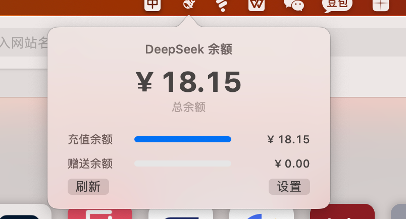

# DeepSeekBalance

macOS 菜单栏 DeepSeek 余额查询工具。在菜单栏显示 DeepSeek API 账户余额，悬停或点击即可查看充值余额与赠送余额的详细构成。



## 功能

- 菜单栏常驻，点击/悬停弹出余额面板
- 显示总余额、充值余额、赠送余额，含进度条可视化
- API Token 通过 macOS Keychain 安全存储
- 自动检测 Token 过期并提示重新输入
- 无第三方依赖，纯 Swift + AppKit，`swiftc` 直接编译

## 系统要求

- macOS 12.0+
- Apple Silicon (arm64)

## 安装与使用

```bash
# 克隆仓库
git clone <repo-url>
cd deepseek_rest

# 编译并生成 .app
./build.sh

# 运行
open build/DeepSeekBalance.app
```

首次启动会提示输入 DeepSeek API Token（格式：`sk-xxxxxxxxxxxxxxxxxxxxxxxx`），Token 将保存至系统钥匙串。

## 使用范围

本工具仅调用 DeepSeek 官方 API `https://api.deepseek.com/user/balance` 查询账户余额信息。不收集、不上传任何用户数据，Token 仅存储于本地钥匙串。

## 已知限制：无法显示日用量

**当前不可实现。** 原因：

1. **DeepSeek 未提供查询 token 日用量的官方 API。** `/user/balance` 接口仅返回账户余额（总余额、充值余额、赠送余额），不包含当日消耗统计。
2. **网页控制台已加强反爬。** 此前通过抓取 DeepSeek 网页控制台 usage 页面来获取日用量的方案，因目标页面反爬策略日趋严格，已不可行。

目前界面上仅展示余额信息，无法显示「今日消耗 token 数」「各模型用量分布」等日用量数据。

## PR 需求：日用量功能

**期待高手贡献 PR，解决日用量获取问题。** 可能的探索方向：

- **Charles/Fiddler 抓包分析** — 对 DeepSeek 桌面端或手机端 App 进行抓包，寻找客户端内部使用的非公开接口。移动端 App 的 API 鉴权方式可能与网页端不同，存在绕过反爬的可能。
- **浏览器扩展方案** — 通过浏览器扩展在用户已登录的 DeepSeek 会话中注入脚本，读取页面数据并写入本地文件，再由本 App 读取。
- **前端流量逆向** — 分析 DeepSeek 网页控制台的 JS bundle，提取内部 API 端点及鉴权逻辑。
- **其他可行方案** — 欢迎任何能不依赖网页爬虫获取日用量数据的方案。

### 提交 PR 前请注意

- 保持项目的零第三方依赖原则（Swift 系统框架除外）
- 日用量数据展示需融入现有余额面板 UI 风格
- Token 仍然仅存储于本地钥匙串，不引入额外的网络传输
- 方案需稳定可用，不依赖随时可能失效的 hack

## License

MIT
